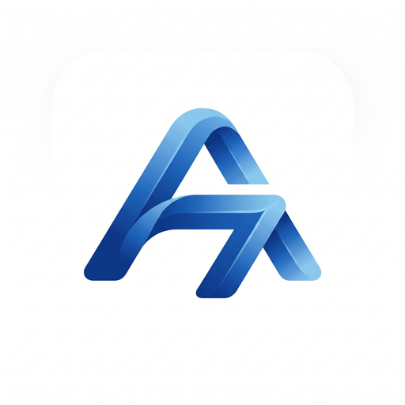

# A7 MUSIC

### 🎵 Music & Sport — All in One App

**A7 MUSIC** is a premium mobile application that uniquely combines **Music Streaming** with **Sport & Fitness Tracking** into a single, powerful experience. Whether you're listening to your favorite tracks or tracking your workouts, A7 MUSIC keeps you in the zone.

---

[📥 Download APK](#-download) · [📥 Download IPA](#-download) · [📧 Contact](#-contact--get-the-project)

---

## 🌟 What Makes A7 MUSIC Unique?

A7 MUSIC is the **first app** to merge a full-featured music platform with a complete sport and fitness tracker. No more switching between apps — one app for your entire active lifestyle.

---

## 🎵 Music Features

| Feature | Description |
|---------|-------------|
| 🎧 **Music Streaming** | Stream millions of tracks with high-quality audio playback |
| 🔍 **Smart Search** | Find songs, artists, and albums instantly |
| 📚 **Music Library** | Organize your favorite tracks, playlists, and albums |
| 🎤 **Artist Profiles** | Explore artist discographies, bios, and related artists |
| 💿 **Album Details** | Browse full album tracklists with artwork |
| 🎛️ **Full Player** | Immersive full-screen player with controls, lyrics, and visualizations |
| 🎵 **Mini Player** | Keep listening while browsing — always-visible mini player |
| 📱 **Background Playback** | Music continues playing when the app is in the background |
| 🤝 **Listen Together** | Share what you're listening to and listen with friends in real-time |

## 🏃 Sport & Fitness Features

| Feature | Description |
|---------|-------------|
| 📍 **GPS Activity Tracking** | Track runs, walks, and cycling with real-time GPS mapping |
| 🗺️ **Live Map View** | See your route on an interactive map as you exercise |
| 📊 **Activity Dashboard** | View detailed stats: distance, pace, calories, duration |
| 🏋️ **Workout Recording** | Record and save your workouts with full session details |
| 📈 **Progress Analytics** | Track your fitness progress over time with charts and stats |
| ⚙️ **Sensor Fusion** | Advanced GPS + accelerometer + gyroscope tracking for accuracy |
| 🎯 **Kalman GPS Filter** | Military-grade GPS smoothing for precise route tracking |

## 📱 Social & Community Features

| Feature | Description |
|---------|-------------|
| 👥 **Social Feed** | Share posts, activities, and music moments with the community |
| 💬 **Real-time Chat** | Message friends directly with instant messaging |
| 📸 **Stories** | Share stories with photos, text, and creative editing |
| 🔔 **Notifications** | Stay updated with real-time push notifications |
| 👤 **User Profiles** | Customizable profiles with QR code sharing |
| 🤝 **Follow System** | Follow friends and discover new people |
| ❤️ **Reactions & Comments** | Engage with the community through likes and comments |

## ⚙️ App Features

| Feature | Description |
|---------|-------------|
| 🌙 **Dark & Light Mode** | Beautiful UI themes that adapt to your preference |
| 🔐 **Secure Authentication** | Login and signup with encrypted credentials |
| ⚡ **Real-time Updates** | Live data synchronization across all features |
| 🌐 **Online Presence** | See who's online and available |
| 📲 **Cross-Platform** | Available on both Android and iOS |
| 🎨 **Modern UI/UX** | Premium glass-morphism design with smooth animations |

---

## 📥 Download

### Android (APK)
> Download the latest APK from the **Releases** page:
>
> 👉 [**Download A7 MUSIC APK**](https://github.com/raouf-djmilo/A7-MUSIC/releases)

**Installation Steps:**
1. Download the `.apk` file from Releases
2. On your Android device, go to **Settings → Security → Unknown Sources** (enable it)
3. Open the downloaded APK file and tap **Install**
4. Launch **A7 MUSIC** and enjoy! 🎉

### iOS (IPA)
> Download the latest IPA from the **Releases** page:
>
> 👉 [**Download A7 MUSIC IPA**](https://github.com/raouf-djmilo/A7-MUSIC/releases)

**Installation Steps:**
1. Download the `.ipa` file from Releases
2. Use **AltStore**, **Sideloadly**, or **TrollStore** to install
3. Trust the developer certificate in **Settings → General → VPN & Device Management**
4. Launch **A7 MUSIC** and enjoy! 🎉

---

## 📸 Screenshots

> *Screenshots coming soon — Stay tuned!*

---

## 🛠️ Tech Stack

| Technology | Purpose |
|-----------|---------|
| React Native | Cross-platform mobile development |
| Expo | Development framework & build tools |
| TypeScript | Type-safe code |
| Supabase | Backend, Auth & Real-time Database |
| React Navigation | App navigation |
| Track Player | Audio streaming engine |
| MapView | GPS & Activity mapping |

---

## 📋 Requirements

| Platform | Minimum Version |
|----------|----------------|
| Android | 7.0 (API 24) or higher |
| iOS | 14.0 or higher |

---

## 📧 Contact & Get the Project

### 🔒 This is a **private project**

The source code is **not publicly available**. Only compiled APK and IPA versions are distributed here.

**If you're interested in the project, want to collaborate, or need a custom version:**

📧 **Email:** [raouf.djmilo@gmail.com](mailto:raouf.djmilo@gmail.com)

🌐 **GitHub:** [@raouf-djmilo](https://github.com/raouf-djmilo)

---

## ⚖️ License

This project is **proprietary software**. All rights reserved.

- ❌ Source code is NOT included in this repository
- ❌ Redistribution of the source code is NOT permitted
- ✅ APK and IPA files are provided for personal use only
- ✅ Contact the developer for licensing inquiries

---

**Built with ❤️ by [raouf-djmilo](https://github.com/raouf-djmilo)**

© 2024–2026 A7 MUSIC. All rights reserved.

